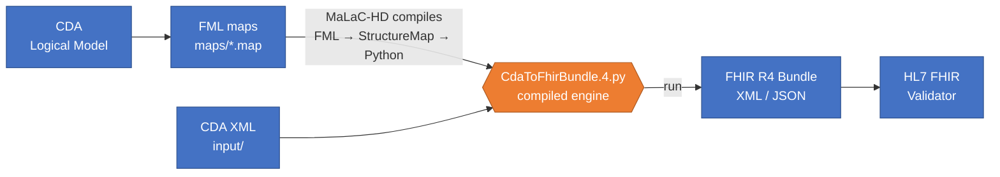

# CDA2FHIR

Transformation of Austrian **ELGA CDA** documents (Laboratory Report and e‑Impfpass) into **FHIR**, written in the **FHIR Mapping Language (FML)**.

The mapping is authored as FML `.map` files. The [MaLaC‑HD](https://gitlab.com/cdehealth/malac-hd) engine compiles those maps into a standalone Python module, which converts a CDA XML document into a FHIR `Bundle`. Every sample is validated against the relevant FHIR Implementation Guide (IG) in CI.

---

## 1. Orientation

- **Input:** an ELGA CDA XML document (Lab report or e‑Impfpass).
- **Output:** a FHIR R4 document `Bundle` (XML or JSON).
- **Source of truth = the FML maps** in [maps/](../maps/). Everything else — the compiled Python, the coverage report, the validation logs — is generated from them. Never hand‑edit the generated files.
- The same maps and the same engine (MaLaC‑HD) are used both **locally** while you author the FML and in **CI** on every pull request.



> See **[documentation/pipeline.md](pipeline.md)** for the full pipeline diagram and how the same maps run both locally and in CI.

### Target branches

The same maps are maintained for two validation targets. Work on the `-dev` branch that matches your goal; the stable branch (`elga` / `myhealtheu`) is the release branch.

| Branch(es) | Target |
|---|---|
| `elga`, `elga-dev` | National **ELGA** / HL7 Austria |
| `myhealtheu`, `myhealtheu-dev` | Cross‑border **MyHealth@EU** / eHDSI |

The mapping logic is largely shared and kept in sync between the two families. They diverge mainly in: the validation IGs (`input/config.json`), the `meta.profile` tags written onto resources, the validator suppressions (`advisor.json`), and the CI release target.

---

## 2. Repository structure

### `maps/` — the FML mapping (the core)
The actual CDA→FHIR logic, split into maps that `import` each other by their StructureMap canonical URL. See [§6](#6-fml-design) for the design.

| File | Role |
|---|---|
| `CdaToFhirBundle.4.map` | **Entry map.** Builds the shared `Bundle` + `Composition` skeleton and the header / patient / author / section groups common to every document type, then — based on `ClinicalDocument.code` — calls the Lab or e‑Impfpass group: LOINC `11502-2` / `18725-2` → Lab, `11369-6` → e‑Impfpass. |
| `CdaLabToFhirBundle.4.map` | **Lab report** map: the Lab‑specific header **and** body (sections → `Observation` / `DiagnosticReport` / `Specimen` / `ServiceRequest`). The largest map. |
| `CdaEimpfToFhirBundle.4.map` | **e‑Impfpass** map: the e‑Impfpass‑specific header **and** body (`Immunization` + `ImmunizationRecommendation`). |
| `CdaToFhirTypes.4.map` | Reusable **CDA datatype → FHIR datatype** transforms (II→Identifier, CE→CodeableConcept, TS→dateTime …) plus the shared nullFlavor / gender / address ConceptMaps. Imported by all of the above. |


### `input/` — sample CDA documents + validation config
- `input/lab/` and `input/eimpf/` — ELGA CDA test files used as CI fixtures (`eimpf` = e‑Impfpass, the electronic vaccination card).
- `input/config.json` — maps each document‑type directory to the FHIR **IG package** it is validated against (plus optional `manualDependencies`).
- `input/<type>/advisor.json` — per‑type validator message suppressions (e.g. known, accepted issues for the APS or LRR profile).
- **CDA specifications:** [Labor‑ und Mikrobiologiebefund Guide](https://wiki.hl7.at/index.php/ILF:Labor-_und_Mikrobiologiebefund_Guide) · [e‑Impfpass Guide](https://wiki.hl7.at/index.php/ILF:E-Impfpass_Guide) (HL7 Austria wiki; the ART‑DECOR templates are linked from there).

### `python-maps/` — the compiled engine output (generated)
- `CdaToFhirBundle.4.py` — the entire mapping **compiled to standalone Python** by MaLaC‑HD. Regenerated automatically in CI; do not edit it by hand.
- `requirements.txt` — pins the engine version (`malac-hd[cda]==1.6.0`). **This is the version that produced the checked‑in `.py`.**

### `scripts/` — CI helpers (Python)
- `convert_and_validate.py` — for each `input/**/*.xml`: runs the compiled `.py` to produce FHIR XML **and** JSON under `output/`, then runs the HL7 FHIR validator into `validation/`, using each type's IG + advisor.
- `combine_coverage.py` — merges the per‑document coverage runs into one HTML/XML report (how much of the generated mapping the samples exercise).
- `update_elga.py` — on a GitHub **release**, opens a merge request in the ELGA GitLab mirror with the compiled `.py`, requirements, docs and samples.

### `ConceptMaps/` — terminology mappings as Excel (deliverable)
> WIP
>Human‑readable `.xlsx` of the `conceptmap` blocks embedded in the maps, grouped by target >terminology (`CDAtoFHIR/`, `MyHealthEU/`, `eImpf/`). These are the terminology >**deliverable**; the runtime source of truth remains the inline `conceptmap` blocks in `maps*.map` (see [§6](#conceptmaps)).

### `.github/workflows/` — CI automation → see [§4](#4-ci-pipeline-github-actions).


### Other files
> **Housekeeping.** `terminology_mapping/` is a single legacy `.xlsx`, superseded by `ConceptMaps/` and only referenced in a code comment — a candidate for deletion. The root‑level `.drawio.svg` / `.plantuml` diagrams are outdated.

---

## 3. Local development with MaLaC‑HD

Running the mapping locally lets you check quickly that the FML compiles and that a CDA sample transforms without errors before you open a PR.

MaLaC‑HD works in two steps, which mirror what CI does:

1. **`FML → Python` (compile).** MaLaC‑HD reads the FML, converts it to a FHIR StructureMap internally, and emits the standalone `python-maps/CdaToFhirBundle.4.py`.
2. **`CDA → FHIR` (transform).** Running that generated Python against an input CDA produces the FHIR bundle.

The team drives both steps from a VS Code **`launch.json`** (Python debugger) with two configurations — *FML → Python* and *CDA → FHIR*.

> **Caveat:** check out the `malac-hd` repository as a **sibling directory** of `CDA2FHIR`. The `launch.json` and the relative paths in `advisor.json` assume that layout and will not resolve otherwise.

See example [launch.json](launch.json)

### Command‑line equivalent

If you prefer the terminal :

```bash
# install the pinned engine
pip install -r python-maps/requirements.txt

# 1. compile the FML to Python
malac-hd -m maps/CdaToFhirBundle.4.map -co python-maps/CdaToFhirBundle.4.py

# 2. transform a CDA sample (output format follows the target extension)
python python-maps/CdaToFhirBundle.4.py -s input/lab/ELGA-043-Laborbefund_EIS-FullSupport.xml -t out.fhir.json   # JSON
python python-maps/CdaToFhirBundle.4.py -s input/lab/ELGA-043-Laborbefund_EIS-FullSupport.xml -t out.fhir.xml    # XML
```

The output file extension selects the FHIR serialization: `.json` → FHIR JSON, `.xml` → FHIR XML.

---

## 4. CI pipeline (GitHub Actions)

| Workflow | Trigger | What it does |
|---|---|---|
| `convert-and-validate.yml` | PR to `elga` / `elga-dev` | Compiles the FML with MaLaC‑HD, runs `convert_and_validate.py` over every sample, validates each output with the HL7 validator, computes code coverage, uploads `output/` `validation/` `coverage/` + the generated `.py` as an artifact, and **fails the check on validation errors** (`check_validation_result.sh`). |
| `fml2python.yml` | push to `elga` | Re‑compiles the FML and **auto‑commits** the regenerated `python-maps/`, keeping the checked‑in Python in lock‑step with the maps. |
| `release.yml` | GitHub **release** published | Runs `update_elga.py` to open a merge request in the ELGA GitLab repository with the compiled artifacts (`.py`, requirements, docs, samples). |

> On the `myhealtheu` / `myhealtheu-dev` branches these workflows carry their own copies with the MyHealth@EU triggers, config, and release target.

**Reading a CI run:** green means every step passed and all samples validated. Red means a step failed — open the run to see which one. For a failed validation, download the run's artifact to inspect the generated Python and the produced FHIR bundles.

---

## 5. Development workflow

1. **Open an issue** for the affected target — ELGA, MyHealth@EU, or both if a change touches both mappings.
2. **Create a branch** from `elga-dev` or `myhealtheu-dev`.
3. **Edit the FML** in `maps/*.map` — this is the only thing you write by hand.
4. **(Optional) Test locally** with MaLaC‑HD ([§3](#3-local-development-with-malac-hd)) to confirm the FML compiles and a sample transforms cleanly.
5. **Commit and open a PR** against `elga-dev` or `myhealtheu-dev`.
6. **Watch the CI check** and iterate until it is green ([§4](#4-ci-pipeline-github-actions)).

---

## 6. FML design

**Modularization.** The mapping is one **router** (`CdaToFhirBundle.4.map`), a shared **datatype library** (`CdaToFhirTypes.4.map`), and one **document specifc model (Lab or eVac)** (Lab, e‑Impfpass). Modules are wired together with `imports "<StructureMap canonical URL>"`; the router dispatches to CdaLabToFHirBundle.4.map or CdaEimpfToFHirBundle.4.map` based on the document's LOINC code.
**Modularization.** The mapping is split into four maps, wired together with `imports "<StructureMap canonical URL>"`:
- **`CdaToFhirBundle.4.map`** — the **entry map**: builds the shared `Bundle` + `Composition` skeleton and holds the header / patient / author / section groups common to every document type.
- **`CdaToFhirTypes.4.map`** — the shared **datatype library**.
- **`CdaLabToFhirBundle.4.map`** and **`CdaEimpfToFhirBundle.4.map`** — one **document‑specific map** per document type (Lab report / e‑Impfpass). Each maps both the **header and body** of its document, extending the shared header/section groups where the document type needs to specialise them.

Based on the document's LOINC code, the entry map **calls** the `CdaLabToFhirBundle` or `CdaEimpfToFhirBundle` group — defined in the matching document‑specific map — and threads the shared `Bundle`, `Composition` and `Patient` into it.

**Groups.** Each `group` maps one source node to one or more target nodes, e.g. `CdaPatientRoleToFhirPatient(source …, target fhir_patient, target fhir_bundle)`.
- **Group calls** — a rule invokes another group by name (`then SomeGroup(src, tgt, fhir_bundle)`), giving deep, composable mapping.
- **In/out params** — the target `Bundle` is threaded through almost every group so nested groups can append their own resources (`entry`) to the one shared document Bundle.
- **`extends`** — a group can specialise a base group (e.g. `CdaAnnotationSectionToFhirSection extends CdaSectionToFhirSection`), so always check both the group and what it extends.

**Default transforms.** Because `CdaToFhirTypes.4.map` is imported everywhere, datatype conversions (e.g. CE→Coding, II→Identifier) are applied by the engine automatically when a rule maps one datatype onto another, without an explicit group call.

### ConceptMaps
- Terminology is translated with inline `conceptmap` blocks invoked via FML `translate(...)` (e.g. NullFlavor → data‑absent‑reason, ELGA gender → FHIR gender, ActStatus → status).
- The blocks live **inside** the `.map` files (the runtime source of truth) and are mirrored as Excel in `ConceptMaps/` for terminology review. 
- ConceptMaps will move out of the `.map` files into standalone `cm.json` resources (loaded at compile time) in a future release. **Work in progress.**

---

## 7. Mapping engine (MaLaC‑HD)

MaLaC‑HD — *MApping LAnguage Compiler for Health Data* — is developed across several GitLab repos under [`cdehealth`](https://gitlab.com/cdehealth). Read each repo's README for detail:

- **[malac‑hd](https://gitlab.com/cdehealth/malac-hd)** — compiles FML / FHIR StructureMap / ConceptMap resources into **standalone Python** that transforms CDA XML → FHIR XML/JSON (internally: FML → StructureMap → Python). Installed here via `malac-hd[cda]`. Key flags: `-m` mapping, `-co` compile‑to‑Python output, `-s`/`-t` transform source/target.
- **[malac](https://gitlab.com/cdehealth/malac)** — the parent compiler group:
  - [malac/models](https://gitlab.com/cdehealth/malac/models) — generated CDA/FHIR data models the compiler emits and imports.
  - [malac/transformer](https://gitlab.com/cdehealth/malac/transformer) — the transformation runtime the generated Python builds on.
  - [malac/utils](https://gitlab.com/cdehealth/malac/utils) — shared utilities.

> MaLaC‑HD uses a bug‑fixed ANTLR grammar for FML / FHIRPath: [`mapping.g4`](https://gitlab.com/cdehealth/malac-hd/-/blob/main/malac/hd/core/fhir/r4/parser/mapping.g4).

---

## 8. FML resources

New to the FHIR Mapping Language? Start here:
- **FML Implementation Guide** — [overview](https://build.fhir.org/ig/HL7/mapping-language-ig/fml.html) and [tutorials](https://build.fhir.org/ig/HL7/mapping-language-ig/tutorial.html).
- **[FHIRPath Lab](https://fhirpath-lab.com/FhirPath)** — inspect bundle output and debug small FML/FHIRPath snippets interactively.

---

## Authors

See the list of [contributors](https://github.com/HL7Austria/CDA2FHIR/contributors).

## Acknowledgments

- [HL7CH — Implementation Guide CDA FHIR Maps](https://github.com/hl7ch/cda-fhir-maps)
- BlackTusk — mapping parts of the Austrian CDA Laboratory Report to FHIR
