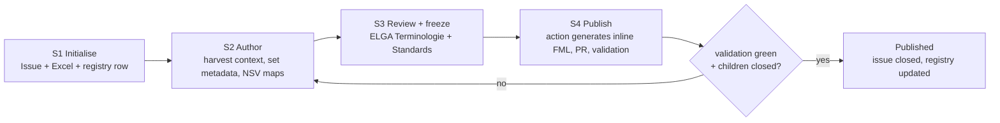

# ConceptMap conventions & workflow

How a ConceptMap (CM) is named, stored, authored, reviewed and published in this repo.

- Owned by #484 · MyHealth@EU twin #485 · parent #482 -> ToDo we need to decide how terminology registry works. Split on the target branches or one branch which gets merged into elga and myhealtheu? probably first approach is better. Altough we would benefit from a target agnostic workflow and target specific workflow to keep git workflow similar. (drifting apart from actions and WI/SOPs needs to be held at a minimum...)
- Applies to **both** CM types (see #482 §1): **Type A** `cdaspec → fhirspec`, **Type B** eHDSI transcoding
- Target: usable for the **9.1.1 release**. Post-MR!106 changes are in §8.

## 0 — Decision status

| | Decision | Status |
|---|---|---|
| D1 | Naming scheme | **proposed** — §2 |
| D2 | Where CMs live | **decided** — §3 |
| D3 | How "no target" is expressed (`noMap` / `unmapped`) | **OPEN** — §4, interim rule applies |
| D4 | Type B removed from `elga-dev` | **proposed** — #486 |
| D5 | CM needed when `CDA.code` is fixed | **decided** — #487 (Lab), #370 (eVac); eMed out of scope. (D5 would fall under D4 but since I already removed eImpf -> we also need to remove Lab) |

## 1 — Terms

- **CM** — ConceptMap. **CM.id** — its identifier; also the filename stem.
- **SpreadCT** — the spreadsheet format a CM is authored in (§5).
- **Registry** — `terminology/cm_registry.md`, the table linking GitHub issue ⇄ file ⇄ status.
- **Type A / Type B** — see #482 §1. Type B artefacts exist on `myhealtheu-dev` only.

## 2 — Naming (D1)

```
<source-vs-id>-to-<target-vs-id>
```

- Casing follows each ValueSet's **published id verbatim** — do not re-case. ELGA ids are lowercase-kebab, eHDSI ids are CamelCase, so mixed casing is expected and correct: `elga-laborparameter-to-eHDSILabCodeWithExceptions`.
- **filename stem = `ConceptMap.id`** → `terminology/cm/<CM.id>.xlsx`, later `<CM.id>.json`.
- Versioning lives in `ConceptMap.version` / the canonical, **not** in the id.

> ⚠ **Constraint — FHIR `id` is `[A-Za-z0-9\-\.]{1,64}`.** The convention can exceed it:
> - `elga-observationinterpretation-to-eHDSIObservationInterpretationWithExceptions` = **78 chars → invalid**
> - the existing `elga-notifiable-condition-case-ident-value-to-eHDSIResultsCodedValueLaboratory` = **78 chars → already invalid today**
>
> **Rule:** if the generated id exceeds 64 characters, drop the `WithExceptions` suffix, then the `eHDSI` prefix, and record the abbreviation in the registry. CI must reject any `CM.id` over 64 characters or outside the charset.

## 3 — Storage (D2)

| Artefact | Location | Authoritative? |
|---|---|---|
| CM content (concepts, mappings) | ELGA SharePoint | **yes** |
| CM spreadsheet snapshot | `terminology/cm/<CM.id>.xlsx` | no — copy taken at review freeze (S3) |
| Inline FML `conceptmap` block | `maps/*.map` | no — **generated** (S4) |
| Registry | `terminology/cm_registry.md` | yes, for *linkage* only |

- Content is **never** edited in GitHub. Content bugs → ELGA SharePoint, tracked on the CM's GitHub issue.
- Generated artefacts are **never** hand-edited.

> ⚠ **Conflict with #483.** #483 removes `MVC_Map_…xlsx` from the repo, but S3 commits a spreadsheet snapshot back into `terminology/cm/`, and S4 needs it as the generator's input. Scope #483 to *"remove the legacy file once its SpreadCT successor exists on SharePoint and the registry row points at it"* — otherwise the two issues contradict each other and the 7 826 inline rules lose their only in-repo provenance.

### Registry columns

`CM.id` · `type` (A/B) · `sourceScope` · `targetScope` · `xlsx path` · `FML call site` · `branch(es)` · `status` (Init / Author / Review / Published) · `GitHub issue` · `reviewed-on` · `source version`

> The last two are cheap now and painful to retrofit — they are what makes a wave update auditable later.

## 4 — `noMap` / `unmapped` (D3 — OPEN)

- **`unmapped`** (a default for everything not listed) — **not used.** Every source concept must have a deliberate, enumerated outcome.
- **`noMap`** (this source concept intentionally has no target) — representation **not yet decided**. @constir1: confirm whether inline FML supports it; check how ELGA SharePoint handles it today. -> If it is not supported inline we can probably just drop this info. Todo confirm after viewing ELGA SharePoint. 

> ⚠ **Interim rule until D3 closes: fail closed.** The S4 action **aborts** on a `noMap` or `unmapped` cell. Do not silently ignore either — an ignored `noMap` emits no rule, so `translate()` falls through at runtime and might produce a wrong or missing code with or a py runtime error.

## 5 — SpreadCT format

- Tab 1 `body` — the concepts and their mappings
- Tab 2 `meta` — `CM.id`, `sourceScope`, `targetScope`, binding info
- Optional `noMap` column, added to the right of `source.display`; absent by default (see §4 for current handling)

> ⚠ **This section is the critical gap.** The S4 generator cannot be written against this description. Before C3 starts, the readme needs: (a) a link to the SpreadCT spec, (b) one committed example file, (c) the exact required column names and order. Note the existing `MVC_Map_…xlsx` uses a *different* 7-sheet layout (`Metadaten MVC`, `Mapping`, `eHDSILabCode`, …) — state explicitly whether it is migrated to SpreadCT or grandfathered.

## 6 — Workflow



### S1 — Initialise

- **GitHub issue** `ConceptMap: <CM.id>` — this is `<GH Issue Current CM>`, the single tracking home for the CM. Body contains: ToDo link · related-issue links (+ flags: *closed, info extracted* / *implementation advice, keep open*) · binding info (`sourceScope`, `targetScope`) · harvested comments (+ *comments found* bool) · general comments · HL7 AT CDA2FHIR AG comments · link to CM Excel · link to review folder. Sub-issue per target if Type A (per #419); cut branch
- **Registry row** — `CM.id`, GitHub issue, status `Init`, type
- **CM Excel** — `CM.id`, `sourceScope`, `targetScope`, empty mapping tables
- **Output:** issue + branch + registry row + empty Excel · **Gate:** all four exist and cross-link

### S2 — Author

**S2.1 Harvest existing context** → document findings on `<GH Issue Current CM>`

- **Issues touching this CM.** Search GitHub for the CM name *and* for `transcoding`, `translate`, `code mapping`, `valueset`, `terminology`, `nullFlavor`, `OTH`, the source/target VS ids — most relevant issues never say "ConceptMap".
  - informative / purely authoring info → extract to `<GH Issue Current CM>`, **close** the source issue
  - implementation / FML-adjacent → note on `<GH Issue Current CM>`, **keep open**, link as child of `<GH Issue Current CM>`
  - unclear scope → split: authoring info to `<GH Issue Current CM>`, new child issue for the FML part, cross-link both
- **Code TODOs / comments.** Record each with its `file:line` so it can be closed in the S4 PR. If none, record "none found" explicitly.
- **Gate:** every finding is either recorded on `<GH Issue Current CM>` or linked as a child issue. Nothing stays only in a comment.

**S2.2 Establish metadata**

- Verify `sourceScope`, `targetScope`, CM binding
- Add source CodeSystems, target CodeSystems, concepts
- Document `noMap` cases (§4)

**S2.3 Hand off to ELGA Terminologie**

- Notify ELGA Terminologie the CM is ready for concept-level mapping (source → target)
- Confirm the CM's intent is unambiguous before mapping starts
- **Gate:** every source concept has a target or a documented `noMap`

### S3 — Review & freeze

- Review by **ELGA Terminologie + ELGA Standards**, in person or online, walking all relevant fields
- **Edit freeze** — no further SharePoint editing. Record the SharePoint file version + row count in the registry at freeze time so S4 can verify it received what was reviewed.
- Mark reviewed on `<GH Issue Current CM>` **and** in the registry
- Migrate SharePoint → GitHub: copy the Excel to `terminology/cm/<CM.id>.xlsx` and commit
- **Gate:** registry status `Review` → row count matches the frozen version

### S4 — Publish

- All child issues of `<GH Issue Current CM>` closed; all local changes committed
- **Git action** (on PR): SpreadCT Excel → inline FML `conceptmap` block
  - aborts on `noMap` / `unmapped` (§4)
  - aborts if `CM.id` violates §2
  - output: FML block + Excel + registry update, all in the PR
- **PR merges only when `convert-and-validate` is green** — this repo's existing validation gate is the automated quality check; do not bypass it
- On merge: close `<GH Issue Current CM>`, comment the PR URL, registry status → `Published`
- **Rollback:** if a published CM proves wrong — revert the PR, reopen `<GH Issue Current CM>`, set registry status back to `Author`

## 7 — Roles

| Step | Drives | Contributes |
|---|---|---|
| S1 | FML dev | — |
| S2.1 | FML dev | — |
| S2.2 | FML dev | ELGA Terminologie |
| S2.3 | ELGA Terminologie | FML dev |
| S3 | ELGA Terminologie + FML dev | — |
| S4 | FML dev | — |

> ⚠ Confirm these assignments — they are inferred from the draft, not agreed.

## 8 — After MaLaC-HD MR !106

Once [!106](https://gitlab.com/cdehealth/malac-hd/-/merge_requests/106) merges and releases:

- **Unchanged:** S1 Initialise → S2 Author → S3 Review. The issue/registry structure stays.
- **Changed:** S4 publishes `terminology/cm/<CM.id>.json` referenced via `-sr` instead of generating an inline FML block. The generator step disappears.
- **Newly possible:** richer `ConceptMap` elements — `unmapped`, `noMap`, `relationship`, `dependsOn`. D3 should be revisited then.
- **Still out of scope:** long-term governance and wave/version maintenance.
